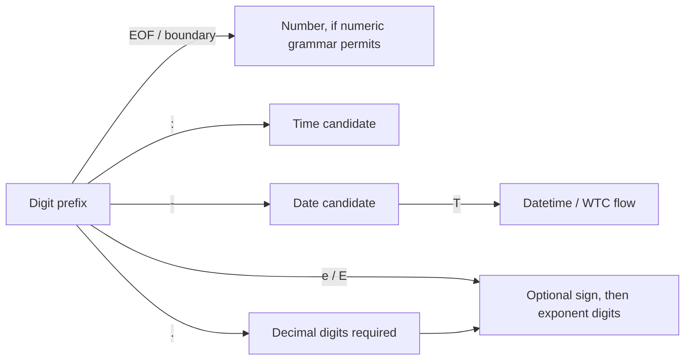
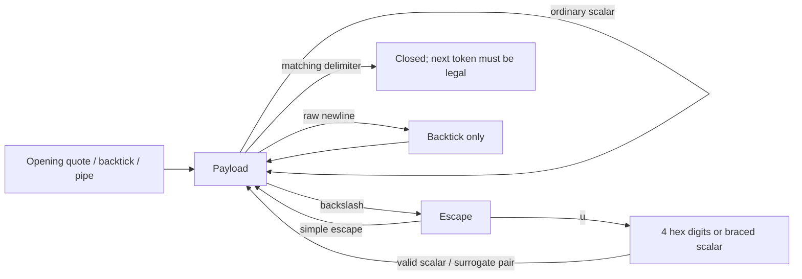

# Canonical And Stress Workflows

Primary scripts:

- `scripts/canonical-cts.sh`
- `scripts/stress-fixtures.py`
- `scripts/stress-canonical-corpus.py`
- `scripts/stress-canonical-snippets.py`
- `scripts/stress-diagnostic-snippets.py`
- `scripts/stress-temporal-flow.py`
- `scripts/stress-literal-flow.py`
- `scripts/mutate-temporal-flow.py`
- `scripts/temporal-sweep.py`
- `scripts/stress-positive-snippets.py`
- `scripts/stress-negative-snippets.py`
- `scripts/stress-whitespace-mutations.py`
- `scripts/stress-combinations.py`
- `scripts/stress-smoke.sh`

## `canonical-cts.sh`

Composite runner for canonical conformance and parity checks.

```bash
bash ./scripts/canonical-cts.sh [--mode <transport|strict|custom|all>] [--brief]
```

Pipeline:

1. TypeScript canonical package tests
2. Python implementation tests
3. Rust canonical package tests
4. External canonical CTS manifest against TypeScript, Python, and Rust
5. Cross-implementation canonical snippet parity
6. Cross-implementation real-document canonical corpus parity
7. Cross-implementation diagnostic snippet parity
8. Grammar-derived temporal flow and canonical parity
9. Literal dispatch, symbols, strings, and trimtick flow

`--brief` keeps failure output concise for CI or quick local loops.

## `stress-canonical-corpus.py`

Recursively discovers real `.aeon` documents and requires the TypeScript,
Python, and Rust formatters to accept each one and emit byte-identical canonical
output.

```bash
python3 ./scripts/stress-canonical-corpus.py [--corpus <directory>] [--brief]
```

The default drop directory is `stress-tests/canonical-corpus/`. The checked-in
seed is a positive snapshot of all AltoPelago website content; its source commit
and the corrections prompted by the initial import are recorded beside the
fixtures.

## `stress-fixtures.py`

Runs curated fixture matrix across selected implementations.

```bash
python3 ./scripts/stress-fixtures.py --impl <typescript|python|rust|all> [--brief]
```

Important flags:

- `--exclude-known-red`: skip known-red cases
- `--fail-known-red`: treat known-red as ordinary failures
- `--timeout <seconds>`: override per-fixture timeout

Summary includes totals for `failed`, `known`, `skipped`, and `passed`.

## Snippet and mutation runners

Use these for focused regressions:

- canonical parity: `stress-canonical-snippets.py`
- real-document canonical parity: `stress-canonical-corpus.py`
- diagnostic parity: `stress-diagnostic-snippets.py`
- positive/negative corpus validation: `stress-positive-snippets.py`, `stress-negative-snippets.py`
- mutation fuzzing and combination matrices: `stress-whitespace-mutations.py`, `stress-combinations.py`
- temporal test-sensitivity audit with isolated source mutations: `mutate-temporal-flow.py`
- opt-in quiet numeric calendar/clock sweep: `temporal-sweep.py` (see [launch and benchmark instructions](temporal-flow.md#numeric-range-sweep))
- fast smoke across implementations: `stress-smoke.sh`

## Boundary note

The [temporal flow analysis](temporal-flow.md) maps the grammar into representative
state transitions, complete paths, range checks, and source boundaries. Run
`python3 scripts/stress-temporal-flow.py` to verify acceptance, exact portable
values, canonical parity, and round trips across TypeScript, Python, and Rust.
Use `--group character-duplication --quiet` for the targeted double/triple
character lane with failures-only output.

These scripts validate implementation behavior and cross-implementation alignment.
They do not redefine AEON Core, AES, or CTS authority.

## Literal dispatch and delimited-literal flow

`stress-literal-flow.py` extends the flow approach beyond temporals. Its expected
results come from independent number grammar, the temporal state machine, a
small quoted-literal decoder, and explicit fixtures for the gutter rules in
`aeonite-specs/sources/aeon/v1/value-types-v1.aeon`, sections 3.1–3.3 and 3.10.1.
No production AEON code participates in generating expected results.

Numeric dispatch is tested without a datatype annotation, so a malformed
temporal cannot pass merely by falling back to an unintended numeric token.
The tests assert the inferred event kind and require full source consumption.



Signs, leading dots, leading zeroes, underscore placement, and incomplete or
mixed continuations are probed separately. The number oracle permits leading
zeroes in exponent digits but not in the integer part of a mantissa, even when
underscores intervene. A numeric source such as `.50` need not preserve its
exact spelling: comparisons preserve its exact decimal value, negative zero,
and broad integer/decimal/exponent family without floating-point arithmetic or
decimal-context rounding. Canonical bytes must still agree across runtimes.

Delimited literals follow this map:



Nonempty decoded content is required for symbols, while ordinary strings and
trimticks may be empty. The matrix tests spaces, embedded comments and grammar
punctuation as payload, escaped delimiters, simple escapes, Unicode scalar
limits and surrogate pairing, incomplete escapes, raw LF/CR rejection where
required, unterminated literals, and illegal adjacent tokens. Backtick escape
handling is tested alongside its permitted multiline payload; this suite does
not reinterpret existing backtick behavior based on the term “raw”. Raw CR/CRLF
payload preservation within backticks is outside this lane's scope; LF payloads
and decoded carriage-return escapes are included.

Trimtick cases separately probe:

1. One `>` marker, optional space, and a backtick opener; repeated markers reject.
2. Blank-line handling and the first nonblank line's space-or-tab gutter choice.
3. Minimum exact-character gutter depth, with mixed indentation as valid payload.
4. Preserved trailing whitespace and interior blank lines.
5. The strict `string` versus `trimtick`/`prose` literal-family boundary.

The two-line gutter matrix covers every pairing of seven representative
indentations (`""`, one/two spaces, one/two tabs, space-tab, tab-space), including
an intervening whitespace-only line. Handwritten fixtures additionally check
inline first lines, empty payloads, and asymmetric depths.

All accepted cases undergo canonicalization, byte parity across TypeScript,
Python, and Rust, idempotence, and semantic reparsing. Exact decoded string and
symbol values must survive. Boundary cases include following assignments,
adjacent comments, lists, tuples, objects, and attributes. Explicitly typed
anonymous list/tuple elements check literal-family compatibility; generic
container annotations alone are not assumed to validate element families.

```sh
python3.14 scripts/test-literal-flow.py
python3.14 scripts/stress-literal-flow.py --report /tmp/literal-flow.json
python3.14 scripts/stress-literal-flow.py --group numeric-dispatch --verbose
```

The runner is quiet except for failures/errors unless `--verbose` is supplied.
`--list` emits fixtures without executing them, and `--group` selects a lane.
Build all three CLI implementations first; missing runtimes are errors, not
skips. Both the oracle checks and full matrix run automatically in
`canonical-cts.sh` and its CI entry point.

The current matrix contains 815 cases: 350 expected acceptances and 465 expected
rejections. All 815 pass across TypeScript, Python, and Rust after the fixes below.

The first run exposed four implementation gaps: Rust accepted `0_1`, rejected
`0e+01`, and allowed ordinary strings for explicit `:prose` bindings; TypeScript
accepted raw CR inside ordinary quoted strings. These are covered by targeted
implementation regressions as well as the matrix. The initial exact-spelling
comparison for numeric AES values was corrected to allow legitimate numeric
normalization, without relaxing exact decoded string/symbol checks.

This remains a bounded observable-behavior analysis, not instrumented lexer
branch coverage. It does not yet add comprehensive incremental chunk splits,
recovery-span parity, SANSA/reference dispatch, every prefixed scalar grammar,
or host/resource-limit exploration.
