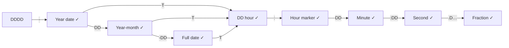
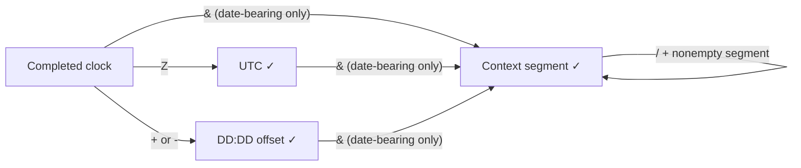

# Temporal lexer flow analysis

`scripts/stress-temporal-flow.py` is an implementation-owned grammar probe for
the AEON v1 temporal rules in `aeonite-specs/sources/aeon/v1/value-types-v1.aeon`,
section 3.9. It tests observable lexer/parser behavior through the public CLI,
portable AES, and canonical formatting. It does not instrument internal lexer
states or replace the specification or CTS authority.

## Grammar map

`D` means one ASCII digit; `DD` and `DDDD` require exactly two and four digits.
Each arrow consumes its label. A completed date can finish or continue with `T`.



Standalone times enter at the hour, but require `:` before they can finish.
Thus `11` is a number, `11:` is a time, and `1111-T11` is a datetime.
The state table in the generator expands each digit of these diagram labels
into a separate state, including nonterminal prefixes.

Every completed clock form can finish, take `Z`, or take a numeric offset:



Context segments contain ASCII letters, digits, `_`, `-`, `+`, and `.`.
The reserved context `local` is case-sensitive. Contexts are preserved without
resolving timezones, timescales, or geographic coordinates.

## Representative classes and range guards

| Class | Representatives / checks |
| --- | --- |
| Ordinary digit | `1` at each transition |
| Ordinary letter | `A`, `a` |
| Significant letter | `T`, `t`, `Z`, `z`, individually |
| Punctuation | `:`, `-`, `+`, `.`, `&`, `/`, `_`, individually |
| Unicode lookalikes | `é`, Arabic-Indic `١` (outside these ASCII classes) |
| Calendar | `0000/0001/9999/10000`, months `00/01/12/13`, day and leap-year boundaries |
| Clock | hours `00/23/24/99`, minutes `59/60`, seconds `59/60/61` |
| Fraction | missing digit, zero, nine/ten digits, 200 digits, repeated decimal point |
| Offset | positive/negative, `-00:00`, hour/minute range, forbidden seconds component |
| Source boundary | EOF, space, tab, LF, CRLF, comma, lists, tuples, objects, attributes, comments |

For each reachable state the generator tests EOF and every representative next
character. Valid transitions into nonterminal states also receive the shortest
valid continuation, so rejecting every incomplete prefix cannot masquerade as
successful transition coverage. Complete paths additionally combine three calendar precisions, five
clock forms, four offset choices, and three context choices. Dedicated boundary
cases retain the surrounding source structure and following assignment. Space
and tab terminate a token but do not separate assignments by themselves; both
properly separated and missing-separator cases are tested.

An independent state machine and calendar/range guards decide expected
acceptance. No production lexer or canonicalizer participates in that oracle.
The generator deliberately keeps strict typed bindings, so a prefix that becomes
an ordinary number cannot accidentally pass as a temporal value.

For accepted cases each of TypeScript, Python, and Rust must:

1. Accept the original source and emit the expected portable AES kind and exact
   authored temporal value at the expected path.
2. Format successfully and agree on canonical bytes across implementations.
3. Produce the same bytes on a second canonicalization.
4. Reparse canonical output with identical portable AES semantics, including
   surrounding bindings. Object binding order is allowed to normalize.

Rejected cases must fail Core compilation. Diagnostic code/span equality is not
asserted here; different lexer recovery paths can explain the same rejection.
Formatting is not a substitute for datatype validation of rejected prefixes.

## Running and reviewing

Build the TypeScript workspace and Rust CLI first. All three implementations
must be present; a missing runtime is a harness error, never a skipped pass.

```sh
python3 scripts/stress-temporal-flow.py --list
python3 scripts/stress-temporal-flow.py --report /tmp/aeon-temporal-flow.json
python3 scripts/stress-temporal-flow.py --group ranges --group hour-only
python3 scripts/test-temporal-flow.py
```

The JSON report includes each generated input, expectation, group, and failure,
plus available canonical outputs. The canonical CI lane runs the oracle
sanity tests and full matrix through `scripts/canonical-cts.sh`.
`--jobs` controls concurrent case execution; each child process has a timeout.
The default matrix is deterministic and bounded rather than exhaustive fuzzing.
It covers representative transitions, not every Unicode character, resource
limit, host boundary, or combination of malformed fields.

Core accepts second `60` and arbitrarily long fractions within resource limits.
GP's second `59` and nine-digit ceilings remain separate AEOS policy checks in
`aeos-validator-cts.v1.next.json`; they must not be used as the lexer oracle.

## Initial findings and regression coverage

The initial analysis exposed four implementation gaps, now fixed and covered:

| Finding | Regression coverage |
| --- | --- |
| All three Core parsers accepted out-of-range hour-only datetimes (`T24`, `T99`), including suffixed forms. | Hour bounds at all three calendar precisions in unit tests; hour-only and transition probes across runtimes. |
| Python accepted non-ASCII temporal digits and context characters. | ASCII lookalikes at grammar states, explicit context cases, and Python Core regressions. |
| Rust consumed adjacent comments as part of ordinary temporal tokens. | Comment-adjacency probes plus Rust one-shot/incremental equivalence at every split; contiguous WTC context comments remain invalid. |
| TypeScript formatted standalone times as complex values inside lists and tuples, disagreeing with Python/Rust. | Container canonical byte parity and focused TypeScript canonical regressions. |

The initial matrix had 1,293 cases: 833 prefix/next-character
probes, 55 valid transition completions, 180 complete compositions, 57 range
cases, 16 hour-only cases, 24 contexts, 96 source boundaries, 16 missing
assignment separators, and 16 adjacent comments. All passed against the local
TypeScript, Python, and Rust builds on 2026-10-02. This is a bounded regression
result, not a proof of exhaustive language conformance; regenerate and rerun
when the specification or implementations change.

## Mutation audit

Run a bounded, opt-in mutation audit with Python 3.12 or newer:

```sh
python3.14 scripts/mutate-temporal-flow.py --report /tmp/temporal-mutations.json
python3.14 scripts/test-mutate-temporal-flow.py
```

The audit changes only disposable copies of Python implementation source. A
fresh process imports each mutant and calls the actual CLI entry point in-process
to avoid thousands of interpreter startups. It reuses the flow runner's parsing,
portable AES, round-trip, and idempotence assertions. Canonical output is also
compared with an unmutated baseline. The normal flow runner separately verifies
that baseline against TypeScript and Rust through their CLI executables.

An unmutated baseline must pass before scoring starts. Source anchors must match
exactly and mutants must compile. Import failures, crashes, timeouts, and harness
failures are invalid experiments, not detected faults. A survivor is run against
an additional diagnostic witness where provided; that witness is first verified
on unmutated code, and is not counted as a matrix detection. The report records
source and matrix hashes, mutation definitions, outcomes, and reproducible
failure examples. `--only <name>` selects a mutation for investigation.

The canonical lane checks mutation definitions for stale anchors and syntax;
the full mutation audit is opt-in. The matrix is unchanged during an audit.
This measures sensitivity to a deliberately selected fault set, not the
probability of finding an arbitrary future bug. It does not mutate Rust or
TypeScript source, measure implementation branch coverage, or exercise all
streaming and resource-limit behavior.

### Results, 2026-10-02

The unchanged 1,293-case matrix detected 27 of 29 valid source mutations. Two
survived, and separate witnesses confirmed genuine behavioral differences:

- Accepting September 31: the original range cases checked April but did not
  cover every month-table entry.
- Rejecting February 28 in a common year: leap-day validity was covered, but
  the valid common-year month-end boundary was missing.

The matrix now adds 72 calendar cases: the penultimate day, last day, and first
invalid day of each month in 2023 and 2024. The expanded 1,365-case matrix
detects all 29 mutations, with no invalid experiments or survivors. No
implementation changes were needed. All 1,365 unmutated cases also pass through
the TypeScript, Python, and Rust CLI executables, including canonical parity
and round trips. The initial malformed mutation definition
was corrected and the original matrix rerun before recording the 27/29 score;
it was not counted as a detection.

The fault set covers hour/minute/second bounds, hour-only clocks, year zero,
century leap rules, month lengths, ASCII restrictions, WTC context separators
and case sensitivity, lowercase UTC markers, fraction precision, and canonical
preservation of calendar omissions, fractions, contexts, and unknown offsets.
Canonical mutations also exercise idempotence and container formatting.

Confidence rating: **high for this bounded class of temporal lexer/canonical
faults**, not almost certain. The before/after results are kept distinct: the
second run verifies repairs to the test suite against already known mutants,
not an independent sample of unseen faults. The mutations target one runtime;
cross-runtime agreement and the independent grammar oracle provide additional
evidence, but neither establishes exhaustive correctness.

## Numeric range sweep

Before the large numeric sweep, a smaller character-duplication lane is also
available in the flow matrix (see below).

`scripts/temporal-sweep.py` is a separate, opt-in numeric sweep. It runs one
seeded random leap year and one seeded random common year through the Cartesian
product of months `00..13`, days `00..32`, hours `00..24`, minutes
`00,06,12,18,24,30,36,42,48,54,59,60`, and seconds `00,59,60,61`.
An additional 24 fixed cases check February boundaries in 1900 and 2000.
Total: **1,108,824 cases per runtime**, or **3,326,472 compiler checks** across
TypeScript, Python, and Rust, excluding worker self-tests.

These are unqualified, full-date/full-clock `datetime` values. The sweep checks
Core acceptance, not actual instants or GP compliance: valid dates with second
`60` must parse in Core. It does not add fractions, offsets, WTC contexts, or
canonical round trips to this million-case grid; the flow matrix, mutation
audit, and schema tests retain those responsibilities. Expected calendar
validity comes from Python's standard-library Gregorian calendar, independently
of AEON implementation code; clock bounds are checked separately.

The workers call the normal public Core compilation functions in persistent
processes, including strict datatype checks. They process bounded batches and
run in parallel; Rust uses a release build. Before testing, every worker must
pass positive/negative controls and report deliberate expectation mismatches.
The controller validates response counts and total sweep completion.

### Run in the background

Requirements: Python 3.12+, Node/pnpm, Rust/Cargo, and installed repository
dependencies. Run from the AEON repository root:

```sh
sweep_dir="$(mktemp -d /tmp/aeon-temporal-sweep.XXXXXX)"
nohup python3.14 scripts/temporal-sweep.py --report "$sweep_dir/report.json" \
  >"$sweep_dir/mismatches.log" 2>&1 </dev/null &
echo "PID: $!  Results: $sweep_dir"
```

The launcher prints the PID and result directory. The runner itself prints
**only mismatches or infrastructure errors**, including during builds. A clean
run leaves the log empty; read the report to distinguish completion from a
still-running process:

```sh
cat "$sweep_dir/report.json"
tail -f "$sweep_dir/mismatches.log"
```

The report is created before building and contains the seed and chosen years.
It is updated atomically after each backend finishes and at completion.
Statuses are `building`, `running`, `passed`, `mismatches`, or `error`.
Only `passed` means all requested checks completed successfully. An externally
killed process can leave `building`/`running`; those are not successful results.
Exit codes: 0 for a clean sweep, 1 for mismatches, 2 for infrastructure failure.
Existing reports are never overwritten. Every mismatch is printed as JSON with
the runtime, exact literal/source, expected/actual acceptance, diagnostics, and
seed; the report retains counts and up to 20 examples per runtime.

By default each run picks and records a fresh seed. To replay, supply the saved
seed and a new report path. For example, from the repository root:

```sh
python3.14 scripts/temporal-sweep.py --seed 20261002 --report /tmp/new-sweep-replay.json
```

Builds are automatic and quiet. `--skip-build` opts into already-built workers
and makes the caller responsible for freshness. Repeat `--impl` to select
specific runtimes; by default all three are required. `--timeout` bounds a
worker response wait (default 60 seconds). The full sweep stays opt-in; the
canonical CI lane runs its quick oracle/protocol/output-contract tests.

### Benchmark evidence

`--benchmark N` samples N positions across the entire grid and also runs the
24 fixed century cases. It does not benchmark just the invalid month-zero
prefix. Benchmark runs remain quiet and put timings in their reports:

```sh
python3.14 scripts/temporal-sweep.py --benchmark 10000 --seed 20261002 \
  --report /tmp/new-sweep-benchmark.json
```

On the local machine on 2026-10-02, seed `20261002` selected leap year 2724 and
common year 7326. The 10,024-case benchmark and a larger 100,024-case benchmark
both passed in all three runtimes. In the larger run, each runtime accepted
52,161 cases and rejected 47,863, matching the independent expectations.

| Runtime | Measured 100,024-case time | Linear full-sweep estimate |
| --- | ---: | ---: |
| TypeScript | 0.89 s | 9.9 s |
| Python | 7.07 s | 78.3 s |
| Rust (release) | 0.41 s | 4.6 s |

The larger parallel benchmark took 7.15 seconds after 2.77 seconds of cached
build work. Budget roughly **1–2 minutes plus build time** for the full parallel
sweep on this machine. This is a measured-sample extrapolation, not a completed
million-case result or a guarantee on other machines.

## Character-duplication stress test

The flow matrix now includes `character-duplication`. Earlier tests included
some repeated punctuation, but did not systematically duplicate every position.
This lane uses 22 valid seeds spanning reduced and full dates/clocks, bounds,
leap days, fractions, `Z`, signed offsets, and WTC contexts. Each character is
independently replaced with two and three copies. Identical results arising
from positions in an existing repeated run are deduplicated. Mutation names
retain the original seed, zero-based index, and total copy count.

The independent grammar oracle determines whether the result is valid; repeated
characters are not blanket errors. Fixed-width fields and structural markers
usually reject duplication, while fraction digits and opaque WTC context
characters often remain legal. A doubled context slash still rejects rather
than turning the remaining text into a comment.

For example, `2002--02`, `2002-003-02`, `10::10:32`, and `2021-TT20:` must all
reject. By contrast, `23:59:60.00100` and `2024-T10&llocal` are valid Core values
and must preserve their exact spelling through canonical round trips.

Run just this lane, with output only on failures/errors:

```sh
python3.14 scripts/stress-temporal-flow.py --group character-duplication \
  --quiet --report /tmp/aeon-temporal-duplication.json
```

The existing TypeScript and Rust CLI builds must be current. The lane is also
part of the full flow matrix, so `canonical-cts.sh` runs it automatically.
On 2026-10-02 all **580 distinct mutations passed across all three runtimes**:
438 expected rejections and 142 expected acceptances. Every accepted case also
passed exact portable-value checks, cross-runtime canonical byte agreement,
canonical idempotence, and semantic round trips. No implementation changes were
needed. The overall flow matrix now contains 1,945 cases.

This is a bounded single-position duplication sweep, not every combination of
multiple independently duplicated positions or arbitrary repetition lengths.
