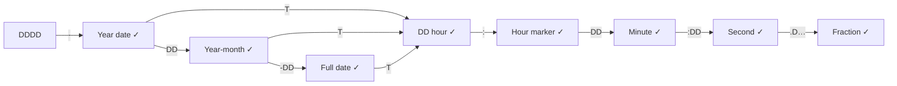
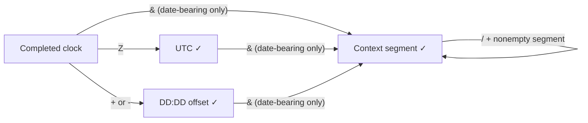

# Temporal lexer flow analysis

`scripts/stress-temporal-flow.py` is an implementation-owned grammar probe for
the AEON v1 temporal rules in `aeonite-specs/sources/aeon/v1/value-types-v1.aeon`,
section 3.9. It tests observable lexer/parser behavior through the public CLI,
portable AES, and canonical formatting. It does not instrument internal lexer
states or replace the specification or CTS authority.

## Grammar map

`D` means one ASCII digit; `DD` and `DDDD` require exactly two and four digits.
Each arrow consumes its label. A completed date can finish or continue with `T`.



Standalone times enter at the hour, but require `:` before they can finish.
Thus `11` is a number, `11:` is a time, and `1111-T11` is a datetime.
The state table in the generator expands each digit of these diagram labels
into a separate state, including nonterminal prefixes.

Every completed clock form can finish, take `Z`, or take a numeric offset:



Context segments contain ASCII letters, digits, `_`, `-`, `+`, and `.`.
The reserved context `local` is case-sensitive. Contexts are preserved without
resolving timezones, timescales, or geographic coordinates.

## Representative classes and range guards

| Class | Representatives / checks |
| --- | --- |
| Ordinary digit | `1` at each transition |
| Ordinary letter | `A`, `a` |
| Significant letter | `T`, `t`, `Z`, `z`, individually |
| Punctuation | `:`, `-`, `+`, `.`, `&`, `/`, `_`, individually |
| Unicode lookalikes | `é`, Arabic-Indic `١` (outside these ASCII classes) |
| Calendar | `0000/0001/9999/10000`, months `00/01/12/13`, day and leap-year boundaries |
| Clock | hours `00/23/24/99`, minutes `59/60`, seconds `59/60/61` |
| Fraction | missing digit, zero, nine/ten digits, 200 digits, repeated decimal point |
| Offset | positive/negative, `-00:00`, hour/minute range, forbidden seconds component |
| Source boundary | EOF, space, tab, LF, CRLF, comma, lists, tuples, objects, attributes, comments |

For each reachable state the generator tests EOF and every representative next
character. Valid transitions into nonterminal states also receive the shortest
valid continuation, so rejecting every incomplete prefix cannot masquerade as
successful transition coverage. Complete paths additionally combine three calendar precisions, five
clock forms, four offset choices, and three context choices. Dedicated boundary
cases retain the surrounding source structure and following assignment. Space
and tab terminate a token but do not separate assignments by themselves; both
properly separated and missing-separator cases are tested.

An independent state machine and calendar/range guards decide expected
acceptance. No production lexer or canonicalizer participates in that oracle.
The generator deliberately keeps strict typed bindings, so a prefix that becomes
an ordinary number cannot accidentally pass as a temporal value.

For accepted cases each of TypeScript, Python, and Rust must:

1. Accept the original source and emit the expected portable AES kind and exact
   authored temporal value at the expected path.
2. Format successfully and agree on canonical bytes across implementations.
3. Produce the same bytes on a second canonicalization.
4. Reparse canonical output with identical portable AES semantics, including
   surrounding bindings. Object binding order is allowed to normalize.

Rejected cases must fail Core compilation. Diagnostic code/span equality is not
asserted here; different lexer recovery paths can explain the same rejection.
Formatting is not a substitute for datatype validation of rejected prefixes.

## Running and reviewing

Build the TypeScript workspace and Rust CLI first. All three implementations
must be present; a missing runtime is a harness error, never a skipped pass.

```sh
python3 scripts/stress-temporal-flow.py --list
python3 scripts/stress-temporal-flow.py --report /tmp/aeon-temporal-flow.json
python3 scripts/stress-temporal-flow.py --group ranges --group hour-only
python3 scripts/test-temporal-flow.py
```

The JSON report includes each generated input, expectation, group, and failure,
plus canonical outputs for failed cases. The canonical CI lane runs the oracle
sanity tests and full matrix through `scripts/canonical-cts.sh`.
`--jobs` controls concurrent case execution; each child process has a timeout.
The default matrix is deterministic and bounded rather than exhaustive fuzzing.
It covers representative transitions, not every Unicode character, resource
limit, host boundary, or combination of malformed fields.

Core accepts second `60` and arbitrarily long fractions within resource limits.
GP's second `59` and nine-digit ceilings remain separate AEOS policy checks in
`aeos-validator-cts.v1.next.json`; they must not be used as the lexer oracle.

## Initial findings and regression coverage

The initial analysis exposed four implementation gaps, now fixed and covered:

| Finding | Regression coverage |
| --- | --- |
| All three Core parsers accepted out-of-range hour-only datetimes (`T24`, `T99`), including suffixed forms. | Hour bounds at all three calendar precisions in unit tests; hour-only and transition probes across runtimes. |
| Python accepted non-ASCII temporal digits and context characters. | ASCII lookalikes at grammar states, explicit context cases, and Python Core regressions. |
| Rust consumed adjacent comments as part of ordinary temporal tokens. | Comment-adjacency probes plus Rust one-shot/incremental equivalence at every split; contiguous WTC context comments remain invalid. |
| TypeScript formatted standalone times as complex values inside lists and tuples, disagreeing with Python/Rust. | Container canonical byte parity and focused TypeScript canonical regressions. |

The checked-in matrix currently has 1,293 cases: 833 prefix/next-character
probes, 55 valid transition completions, 180 complete compositions, 57 range
cases, 16 hour-only cases, 24 contexts, 96 source boundaries, 16 missing
assignment separators, and 16 adjacent comments. All passed against the local
TypeScript, Python, and Rust builds on 2026-10-02. This is a bounded regression
result, not a proof of exhaustive language conformance; regenerate and rerun
when the specification or implementations change.
